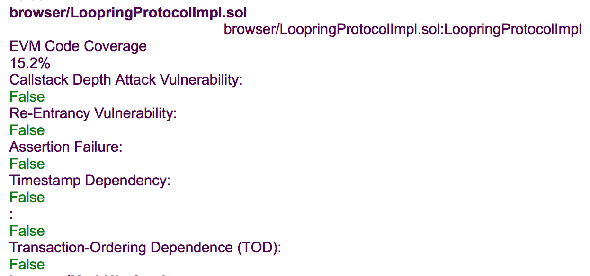

# Code Coverage and Oyente

## Code Coverage

### ```/```


### ```contracts/```


### ```contracts/lib```


### ```contracts/test```


## Oyente Report

### LoopringProtocolImpl.sol


### TokenTransferDelegate.sol


### TokenRegistry.sol


### RinghashRegistry.sol


### MathBytes32.sol


### MathUint.sol


### MathUint8.sol


### Ownable.sol


## SolGraph

### ```LoopringProtocol.sol```


### ```LoopringProtocolImpl.sol```


### ```RinghashRegistry.sol```


### ```TokenRegistry.sol```


### ```TokenTransferDelegate.sol```
